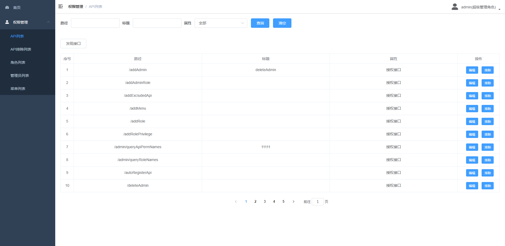
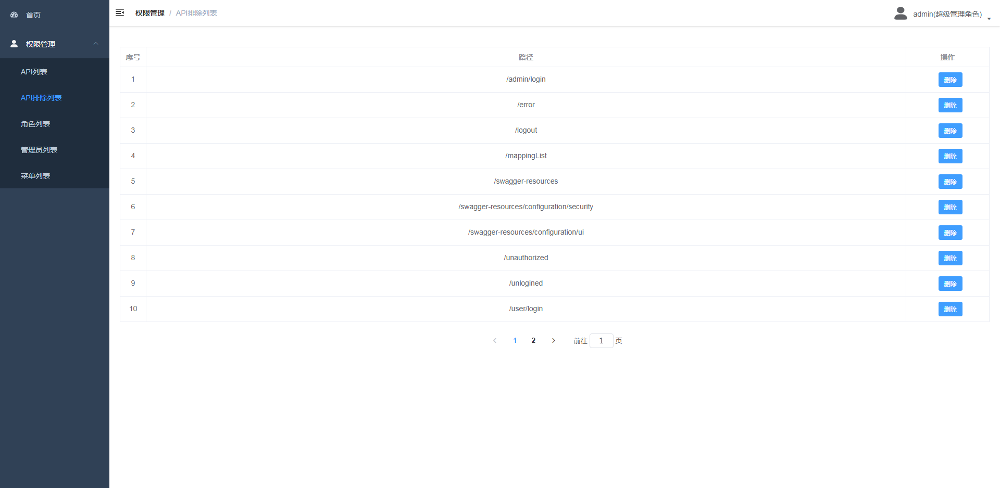
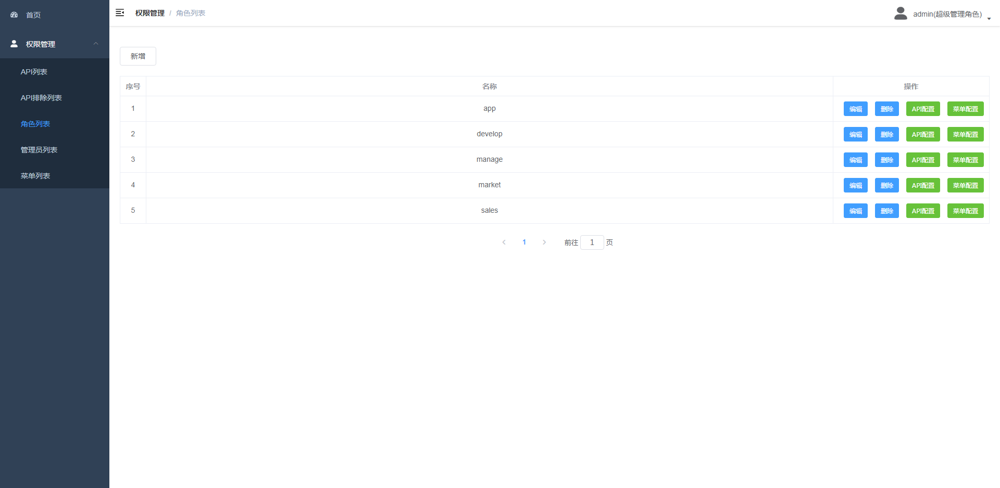
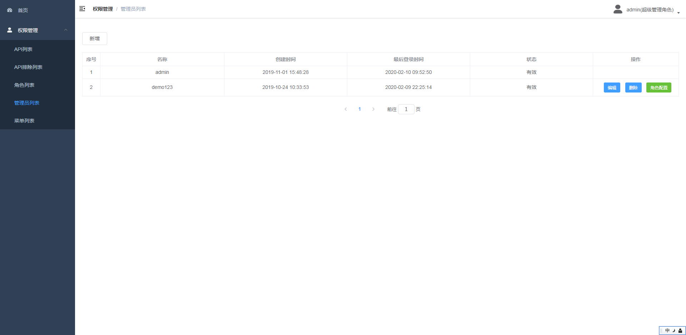
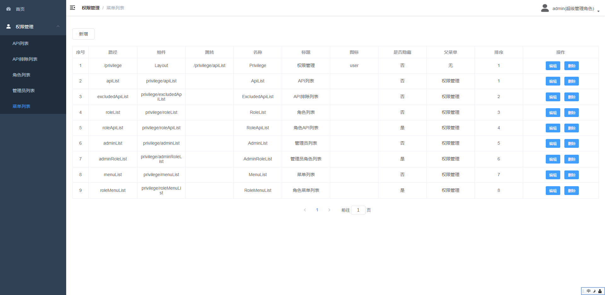

## 功能
权限控制的前端管理,基于vue-element-admin

## 配置
1. config/dev.env.js  配置开发环境的后端地址
2. config/prod.env.js 配置生产环境的后端地址
3. config/index.js    配置监听端口,proxyTable等

## 截图

## 后端
https://github.com/jevislee/ac_springboot_shiro